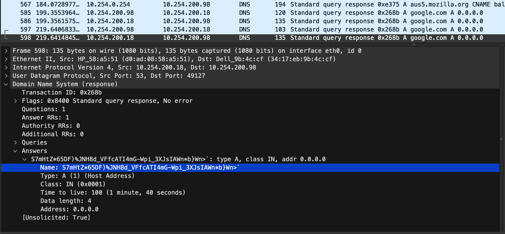

# Do you know Google ?

| Name | Category | Difficulty |
| :---: | :---: | :---: |
| Do you know Google ? | Network | Easy |

Do you know Google ? is a pretty common Network chall. The concept is to hide message encoded in base85 hidden inside DNS response packets. 

This chall is made possible thanks to the tool made by John [Original files](https://github.com/EasyAI/DNS_Steganography).

- [Do you know Google ?](#do-you-know-google-)
  - [Description](#description)
  - [Solution](#solution)
  - [Adaptation](#adaptation)
  - [Creation of the chall files](#creation-of-the-chall-files)

## Description

Your coworker sent you a frame capture from a computer of your network.

He suspects that a malicious actor is using this machine to exfiltrate inforamtions.

---

Un collègue vous envoit un extrait d'une capture de trame d'une machine. 

Il suspect que des acteurs malveillants l'utilisent pour extraire des informations.

## Solution

To solve this chall you need to filter the capture to only have DNS packets. Then find the packets that respond to the google.com FQDN. Inside the packet, in the `Answer` attribute you will find a base85 value wich correspond to the message sent.

## Adaptation

If you want to change some aspect of this chall you can modify the original code made by John to satisfy your desire.

## Creation of the chall files

I have not attach a file for this chall but the creation of one is pretty simple.
First you need to clone the repository to retrieve the client and server programs.
Then launch a wireshark capture and wait for some legit packet before sending some message or the flag via the client and server programs.
