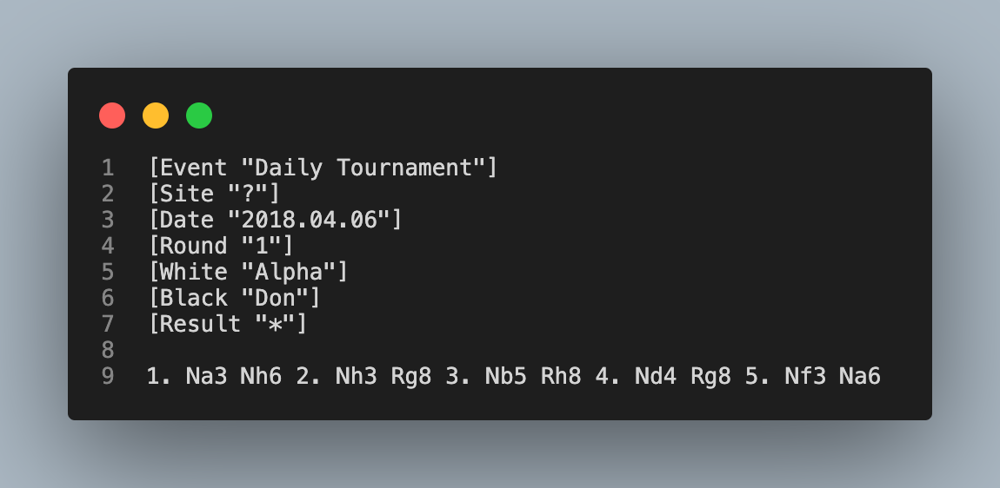

# Let's play chess

| Name | Category | Difficulty |
| :---: | :---: | :---: |
| Let's play chess | [Steganography](../README.md) | [Medium](../../../Difficulty/Medium.md) |

Let's play chess is a steganography chall that I have made for a CTF. It consist of a message or a file hidden inside a PGN file. [PGN](https://en.wikipedia.org/wiki/Portable_Game_Notation) is a plain text file format used to record chess games. 

It was made possible thanks to the [tool made by KKLockenbrink](https://github.com/KKlockenbrink/Chess_Steganography). It contains two script wich can encode and decode from a pgn file. It is base on the [python-chess](http://python-chess.readthedocs.io/en/latest/) library.

- [Let's play chess](#lets-play-chess)
  - [Description](#description)
  - [Solution](#solution)

## Description

A friend of you just discover a python library. He explain that [python-chess](http://python-chess.readthedocs.io/en/latest/) is a library made to play chess with python. After explaining how it works your friend tell you that he made a challenge for you. "During one of my game I hide a message. Find it in my game summary file !"

---

Un ami vous fait montre une bibliothèque python qu'il vient de découvrir. Il vous explique que [python-chess](http://python-chess.readthedocs.io/en/latest/) est un module permettant de jouer aux échecs en python. Après vous avoir expliqué son fonctionnement, votre ami vous indique qu'il souhaite vous mettre au défis. 
Son défis est le suivant : "Durant une de mes parties d'échec, j'y ai glissé un message. Retrouve-le dans le fichier récapitulatif de ma partie !"

## Solution

To solv it you need to write your own tool to decode the file or find the one made by [KKLockenbrink](https://github.com/KKlockenbrink/Chess_Steganography).

