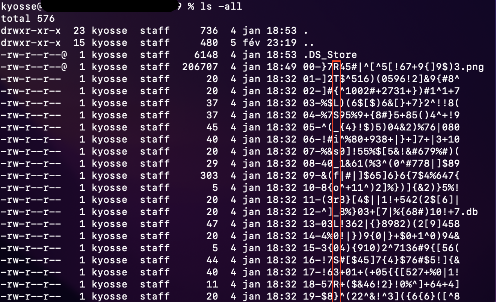

# LiSt Files

| Name | Category | Difficulty |
| :---: | :---: | :---: |
| LiSt File | Steganography | Easy |

LiSt Files is a steganography chall that I have made for a CTF. The concept is to hide message in multiple filename and recover them with the `ls -all` command. 

If you want to use this chall in the configuration you can use this [zip](LiSt_Files.zip) wich contains all the file. If you want to change the flag and/or other parameters you can read the following points: 

- [LiSt Files](#list-files)
  - [Description](#description)
  - [Solution](#solution)
  - [Adaptation](#adaptation)
  - [Creation of the chall files](#creation-of-the-chall-files)

## Description

You just bought a used hard drive to upgrade your computer. After mounting it you found out that is has not been reset.

In between all thoose files you came across this weird directory which contains a bunch of random file.

Find what's going on with thoose files. (All the files are important)

---

Vous venez d'acheter un disque dur d'occasion. Après l'avoir installé vous vous aprercevez qu'il n'a pas été réinitialisé.

Parmi tous les fichiers vous tombez face à ce répertoire bizarre qui contient plein de fichiers différents.

Trouvez ce qui se passe derrière ces étranges fichiers. (Tous les fichiers sont importants)

## Solution

To solve this chall you just need a basic unix command. Apply the command `ls -all` in each directory to see the conversation and the flag.



## Adaptation

In this configuration I consider this challenge easy. It is still possible to modify it in effort to make it easier or more difficult. Here the list of settings that would be pertinant to modify :

* Title
* Chall desc
* Number of folder (correspond to the number of sentence in the variable [self.__messages](create_chall.py))
* Length of the filenames
* Content of the files
* Type of char for the filenames
* Insertion of directory without a sentence.
* ...

Note that some of elements are directly adjustable in the [script](create_chall.py) that create the chall files.


## Creation of the chall files

I've made a little program to create the directories and files. It is possible to adjust some parameters that I've talk just before.

```shell
python3 create_chall.py
```

If you run it directly it will create the files with the parameters that I consider for a difficulty easy. Feel free to adjust it.

Most of the parameters are in the [constructor](create_chall.py) function but some like the length are in the [main](create_chall.py) function.
